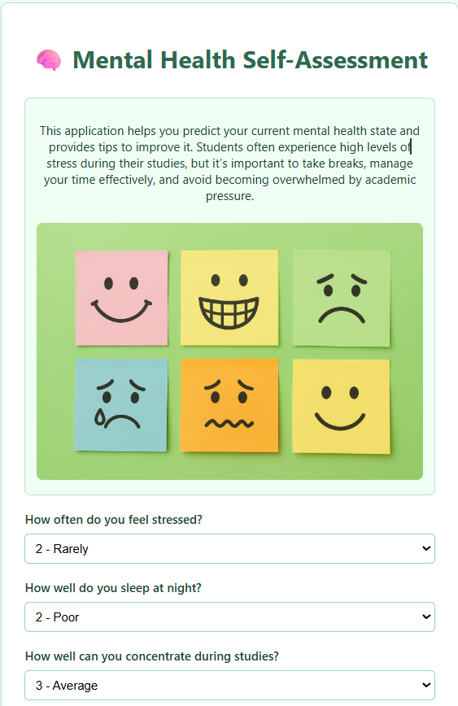
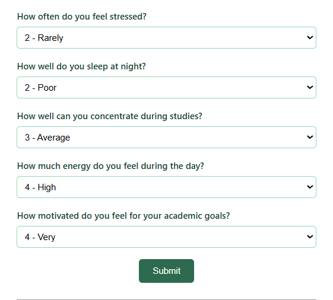

# Mental Health Self-Assessment App 🧠

## Project overview :
This project implements a logistic regression model to predict whether a student is in good or not good mental health based on responses to an HTML form.

## Features:

•	User-friendly web interface built with Flask.

•	Inputs : stress, sleep, concentration, enery and motivation.

•	AI model : logistic regression to predict mental health.

•	Personalized advice based on user responses.

## Technologies :
Python
Flask
Scikit-learn
Pandas
HTML/CSS for fronted
Joblib
SQLite

## Project Structure :

mental_health_app/

├── 01-generate_and_engineer_data.py  # Data preparation and feature engineering  
├── 02-explore_data.py                 # Data analysis  
├── 03-model_training.py               # Model training and evaluation  
├── 04-app.py                         # Flask web app   
├── mental_health_students.db          # SQLite database  
└── templates/                        # HTML templates for the app  
    └── form.html                    # Web form and results   
Form :

  

  

Results :

  

## What I learned :

•	Generation, engineering and analyzing data with Pandas and Numpy.

•	Training and evaluating logistic regression models with scikit-learn.

•	Creating an API with Flask and user-friendly web interface with HTML and CSS.

## Challenges and solutions :

To make the training realistic and challenging for the AI model, I added noise to responses to simulate natural variations in human answers and injected 10% full random answers to simulate inconsistent or noisy data during data generation.

I also had to align input form data with the model's expected features, like inverting stress scores. solved by preprocessing user inputs before prediction.

Created a responsive and clean design with a green theme for comfort and accessibility.

If you want to learn more about this project or discuss collaboration opportunities, feel free to contact me!

Thank you for checking out my project !
